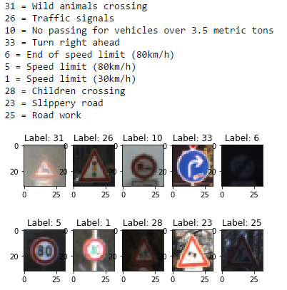

# **Traffic Sign Recognition** 
### Self-Driving Car Engineer Nanodegree - _Project 2_
### By: **Soroush Arghavan**
---

**Build a Traffic Sign Recognition Project**

The goals / steps of this project are the following:
* Load the data set (see below for links to the project data set)
* Explore, summarize and visualize the data set
* Design, train and test a model architecture
* Use the model to make predictions on new images
* Analyze the softmax probabilities of the new images
* Summarize the results with a written report

[//]: # (Image References)
[image1]: ./Capture.PNG "Visualization"
[image2]: ./Capture1.PNG "Distribution of Labels in the Training Data Set"
[image3]: ./Capture2.PNG "Distribution of Labels in the Validation Data Set"
[image4]: ./Capture3.PNG "Distribution of Labels in the Test Data Set"
[image5]: ./Capture4.PNG "PreProcessing"
[image6]: ./Capture5.PNG "5 New Test Images"
[image7]: ./Capture6.PNG "Feature Visualization of Convolution Layer 2"
[image8]: ./hard_images/0.jpg "Difficult Test 1"
[image9]: ./hard_images/1.jpg "Difficult Test 2"
[image10]: ./hard_images/2.jpg "Difficult Test 3"
[image11]: ./hard_images/3.jpg "Difficult Test 4"

---

### Data Set Summary & Exploration

#### 1. Provide a basic summary of the data set and identify where in your code the summary was done. In the code, the analysis should be done using python, numpy and/or pandas methods rather than hardcoding results manually.

The code for this step is contained in the second code cell of the IPython notebook.  

Numpy was used to extract a summary of the data set characteristics as follows:

* The size of training set is 34799
* The size of test set is 12630
* The shape of a traffic sign image is (32, 32, 3)
* The number of unique classes/labels in the data set is 43

#### 2. Include an exploratory visualization of the dataset and identify where the code is in your code file.

The code for this step is contained in the third code cell of the IPython notebook.  

First, let's take a look at the visual representation of the data sample. For this purpose, a random set of 10 images from the training data is displayed below.

In order to better understand the distribution of the data, it is necessary to examine the labels and the number of samples associated with each one. The figure below portrays the distribution of labels among the training data set.

![image2]
![image3]
![image4]

### Design and Test a Model Architecture

#### 1. Describe how, and identify where in your code, you preprocessed the image data. What tecniques were chosen and why did you choose these techniques? Consider including images showing the output of each preprocessing technique. Pre-processing refers to techniques such as converting to grayscale, normalization, etc.

The code for this step is contained in the fourth code cell of the IPython notebook. 

My first intuition about preprocessing the data was whether it would be better to process the images in greyscale or RGB. I assumed that RGB would be more beneficial since there will be more information layers to help classify the images. For example, detecting the color red in a sign would limit its categories to warning-type signs, detecting a high percentage of blue subpixels would mean certain permissions are allowed and so on.

I first ran the model without any preprocessing to see the result. However, I did not manage to achieve an acceptable accuracy. 

For the next trial, I added greyscale conversion as the first step of the preprocessing. Next, in order to minimize bias error and also to train the model with smaller weights, the images were normalized and then fed to the training pipeline. An example of processing stages on an image is shown below.

![image5]

#### 2. Describe how, and identify where in your code, you set up training, validation and testing data. How much data was in each set? Explain what techniques were used to split the data into these sets. (OPTIONAL: As described in the "Stand Out Suggestions" part of the rubric, if you generated additional data for training, describe why you decided to generate additional data, how you generated the data, identify where in your code, and provide example images of the additional data)

I used the provided training, validation and test data sets without alteration. The only step I took was to shuffle the data sets before feeding them to the training pipeline. One experiment was to flip the images along their vertical axes to create augmented data sets for training. However, this did not improve accuracy and is not discussed here.

Although, my experiment was not successful, it is possible that other techniques such as adding random noise to the training set, as well as adding distortion could improve the accuracy of the model.

#### 3. Describe, and identify where in your code, what your final model architecture looks like including model type, layers, layer sizes, connectivity, etc.) Consider including a diagram and/or table describing the final model.

The code for this step is contained in the fifth code cell of the IPython notebook. 

My final model consisted of the following layers:

| Layer         		|     Description	        					| 
|:---------------------:|:---------------------------------------------:| 
| Input         		| 32x32x1 greyscale, normalized image			| 
| Convolution 3x3     	| 1x1 stride, same padding, outputs 32x32x6 	|
| RELU					|												|
| Max pooling 3x3	    | 1x1 stride, valid padding, outputs 30x30x6 	|
| Convolution 5x5     	| 1x1 stride, valid padding, outputs 26x26x16 	|
| RELU					|												|
| Max pooling 2x2	    | 2x2 stride, valid padding, outputs 13x13x16 	|
| Convolution 5x5     	| 1x1 stride, valid padding, outputs 9x9x24 	|
| RELU					|												|
| Max pooling 2x2	    | 2x2 stride, valid padding, outputs 4x4x24 	|
| Flatter				| 384        									|
| Fully connected		| outputs 240       							|
| Fully connected		| outputs 120        							|
| Fully connected		| outputs 43        							|
| Softmax				| cross entropy        							|
| Reduce mean			| loss calculation								|
| Optimizer				| Adam optimizer								|

#### 4. Describe how, and identify where in your code, you trained your model. The discussion can include the type of optimizer, the batch size, number of epochs and any hyperparameters such as learning rate.

The code for training the model is located in the fifth and sixth cells of the ipython notebook. 

I used the Adam optimizer for this project. After many iterations, it was found that a batch size of 60-90 would yield the best results for this model. Furthermore, some fluctuation in validation accuracy between different epochs were notices. In order to stabilize the gradients, the learning rate was reduced to 0.0007 and in return, the number of epochs was increased to 15 in order to counter the slow descent of the new learning rate. Furthermore, it was found that although the dropout probability did not show significant effect on the LeNet architecture, it was proven to be effective in increasing validation accuracy of the new architecture.

It was found that a keep probability of 0.6 yields optimized results for the model.

#### 5. Describe the approach taken for finding a solution. Include in the discussion the results on the training, validation and test sets and where in the code these were calculated. Your approach may have been an iterative process, in which case, outline the steps you took to get to the final solution and why you chose those steps. Perhaps your solution involved an already well known implementation or architecture. In this case, discuss why you think the architecture is suitable for the current problem.

The code for calculating the accuracy of the model is located in the ninth cell of the Ipython notebook.

The LeNet model was used as a stepping stone for this project. With a batch size of 128, learning rate of 0.001 and 10 epochs, the training data were fed directly to the model.

However, it was found that the resulting accuracy of the model on the verification data was arounnd 87 percent. In order to increase the accuracay of the model, and in order to reduce the possibility of overfitting, a dropout layer was added before the first fully connected layer with a dropout probability of 10 percent. Moreover batch size was reduced to 80 and the model was retrained.
Using the new parameters, the accuracy was increased to 91.7 percent. At this point, effects of the training parameters were examined in order to find the best approach to increasing the model accuracy. The results are shown below:

| Epochs	|	Learning Rate	|	Batch Size |	Keep Rate	| Accuracy 
|:---------:|:-----------------:|:------------:|:--------------:|:--------:| 
|10			|0.001		 		|100		   |0.9		 		|89.2|
|10		    |0.001 		  		|64 		   |0.9		 		|91.7|
|10			|0.001		  		|80			   |0.95            |91.8|
|15  		|0.001		  		|80			   |0.97	        |91.9|

The results showed no significant effect from any of the parameters. However, it was apparent that the learning rate could need to be decreased as there was noticeable fluctuation of validation accuracy between epochs.

Next, effect of generating more training samples was examined. In order to generate alternative training data, the training data were flipped along their vertical axes and added to the shuffled data set. This would introduce more training samples and counter the effects of unsymmetry in the images. However, the results did not show any promise as the validation rate remained below 92 percent.

At this stage, it was clear the the layers of the underlaying network are not perfectly suited for this data set. One mentionable approach was to adjust the size of the filters in the convolution layers. The size of the filters were altered between 3x3 to 5x5 and 7x7 pixels. The idea behind this approach was to try to force the layers to look for features of smaller or larger sizes. With no progress in sight, it was time to think of an alternative approach.

The LeNet model was developed for handwriting recognition on the MNIST data set which involves 10 classes. Our current data set has 43 different classes to identify with complicated and subtle differences between the images. Therefore, in order to be able to identify more complicated features, addition of another layer to the model could be of help.

In order to add another layer to the network, the parameters of the other two convolution layers such as filter sizes and depths, as well the the fully connected layer depths need to be readjusted. This is necessary in order to keep the difference between the depth of two adjascent layers to a low amount which could help in stability of the model.

My final model results were:
* training set accuracy of 98.5
* validation set accuracy of 94.1 
* test set accuracy of 91.9
 

### Test a Model on New Images

#### 1. Choose five German traffic signs found on the web and provide them in the report. For each image, discuss what quality or qualities might be difficult to classify.

The code for this step is contained in the seventh code cell of the IPython notebook. 

I searched for german traffic signs on the internet. I found one image that was worthy of testing which is image number 2. This image is interesting due to snow covering parts of the sign as well as the black and white background that adds to noise.

For other samples, I decided not to try stock images and instead, try taking samples from an actual dash cam footage of a vehicle in Munchen, Germany. For this purpose I used [this video](https://www.youtube.com/watch?v=Tq-Xziv-8xY). I took four interesting samples from this video and used them as test subjects. Two of these samples could be difficult to classify. Number 0 is slightly warped and number 3 has unfavorable lightling conditions.

![image6]

#### 2. Discuss the model's predictions on these new traffic signs and compare the results to predicting on the test set. Identify where in your code predictions were made. At a minimum, discuss what the predictions were, the accuracy on these new predictions, and compare the accuracy to the accuracy on the test set (OPTIONAL: Discuss the results in more detail as described in the "Stand Out Suggestions" part of the rubric).

The code for making predictions on my final model is located in the tenth cell of the Ipython notebook.

Here are the results of the prediction:

| Image			        |     Prediction	        					| 
|:---------------------:|:---------------------------------------------:| 
| Priority Road     	| Priority Road 								| 
| Pedestrians     		| Speed limit (30km/h) 							|
| Speed limit (50km/h)	| Speed limit (50km/h)							|
| Speed limit (80km/h)  | Speed limit (80km/h)			 				|
| Ahead only			| Ahead only      								|

It was to my surprise that 4 of the images were classified correctly. The only failure was the sign that is covered with snow (number 2). This translates into an accuracy of 80 percent which is comparable to the test data set accuracy since the misclassified image was chosen as a difficult sample to identify and the sample size was extremely small. 

I also tried the following images on the model. These samples would be difficult to classify and were chosen for experimentation purposes. None of these test subjects were classified by the model correctly. My hypotheses would be the distortion, human face as well as having multiple signs in the image are the reasons for failure. Taking a deeper look at the features of each layer of the network could provide more insight into the features that caused the misclassification.

![image8] ![image9] ![image10] ![image11]

#### 3. Describe how certain the model is when predicting on each of the five new images by looking at the softmax probabilities for each prediction and identify where in your code softmax probabilities were outputted. Provide the top 5 softmax probabilities for each image along with the sign type of each probability. (OPTIONAL: as described in the "Stand Out Suggestions" part of the rubric, visualizations can also be provided such as bar charts)

The code for making predictions on my final model is located in the 11th cell of the Ipython notebook.

The top 5 softmax possibilities for the 5 test images as well as the corresponding labels are as follows:

Image 0
Softmax 
[  9.68340397e-01   2.87030190e-02   1.08602922e-03   4.23786987e-04
   3.02637636e-04]
Top Guesses 
a) 12
b) 40
c) 38
d) 1
e) 35

Image 1
Softmax 
[ 0.64811838  0.27712172  0.03389869  0.01506209  0.0149643 ]
Top Guesses
a) 18
b) 11
c) 26
d) 37
e) 40

Image 2
Softmax 
[ 0.96986639  0.01685805  0.00793509  0.00349806  0.00167412]
Top Guesses 
a) 2
b) 3
c) 5
d) 14
e) 1

Image 3
Softmax 
[  9.28102612e-01   7.18947202e-02   1.47685796e-06   6.27514964e-07
   3.63612713e-07]
Top Guesses 
a) 5
b) 3
c) 7
d) 2
e) 4

Image 4
Softmax 
[  9.99709904e-01   2.85126967e-04   3.23948893e-06   4.69287926e-07
   3.94240089e-07]
Top Guesses 
a) 35
b) 36
c) 40
d) 13
e) 33

It can be seen that the model predicted Image 4 with 99.97 percent accuracy. The model also succeeded in predicting Images 0, 2 and 3 correctly with an accuracy of more than 92 percent which shows the confidence of the model. However, the model failed to identify Image 1 currectly which could be associated with the fact that parts of the sign are covered with snow as well as the background which adds to the random noise in the processed image.

It is also worth mentioning that the model's confidence was lower with Image 1 at around 65 percent. This as well as the other 4 guesses of the model could provide insight into how the model features can be improved.

### 4. Visualization of the neural network features

For this purpose, the second layer of the neural network is chosen for demostration. This layer contains 16 features. In order to study the features, one of the new test images is run through the model and the features are visualized.

It can be seen that the model was accurately trained to recognize the shape of the arrow as well as the round shape of the sign as important features at this layer. This visualization provides insight into how the layers can be redesigned for higher accuracy and efficiency. For instance, a few features at this layer seem to be looking for the same characteristics of the input image (arrow). Can the number of features at this layer be reduced? Are the duplicate features offering any advantages? How are the features different with more complex inputs?

![image7]